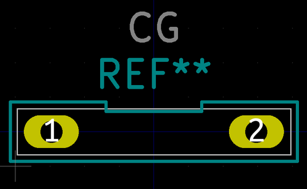
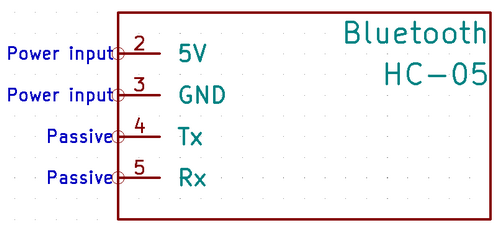
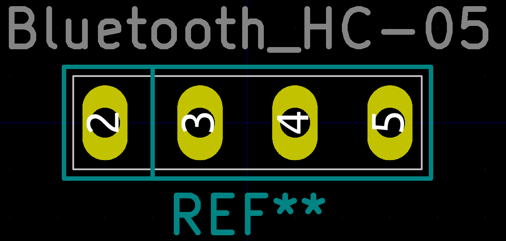
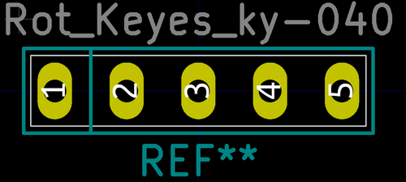
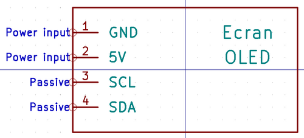
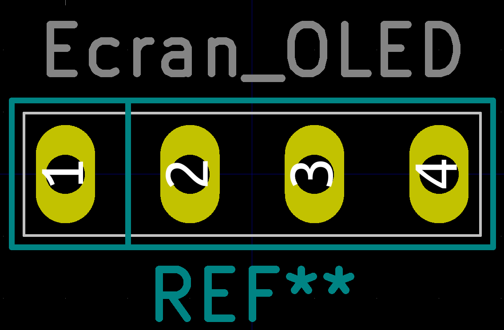
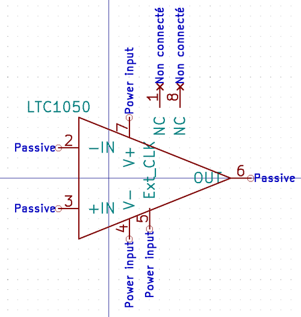
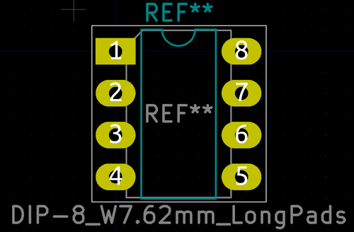

# 2020-2021 : Capteur Graphite GAICH-STEPHEN 
2020-2021 : Projet réalisé dans le cadre de l'Unité de Formation "du capteur au banc de test" en 4ème année Génie Physique, à l'INSA de Toulouse. Au cours de ce projet, nous avons réalisé un capteur de déformation/ jauge de contrainte à base de graphite 2H. Afin de mesurer la résistance de ce type de crayon, nous avons crée un dispositif bas-coût et transportable qui fut proposé par nos enseignants. Nous avons réalisé et fabriqué un PCB shield, à l'aide du logiciel Kicad, contenant un amplificateur transimpédance (circuit analogique) , un module Bluetooth, un écran OLED et un encodeur rotatoire. Ce dernier est pluggé sur un microcontrôleur Arduino Uno programmé à l'aide du logiciel Arduino IDE et contrôlé par une application android APK bluetooth. 

  - [Livrables](#livrables)
  - [PCB Shield](#pcb-shield)
  - [Code Arduino Mesure](#code-arduino-mesure)
  - [Application android APK](#application-android-apk)
  - [Protocole de test du capteur](#protocole-de-test-du-capteur)
  - [Code Arduino banc de test](#code-arduino-banc-de-test)
  - [Datasheet capteur graphite](#datasheet-capteur-graphite)

## Livrables  

- [ ] PCB shield 
- [ ] Code Arduino permettant la mesure de R et le contrôle des fonctionnalités BT, OLED... 
- [ ] Application android APK réalisé avec MIT APP INVENTOR.
- [ ] Protocole et le programme Arduino pour le banc de test
- [ ] Datasheet du capteur de déformation/ jauge de contrainte à base de graphite 2H 

## PCB Shield
Utilisation des outils présents dans le logiciel Kicad pour créer le PCB: 
[KiCad EDA - Schematic Capture & PCB Design Software](https://kicad-pcb.org/), version: 5.1.8 

Le PCB Shield est pluggé sur un microcontrôleur Arduino Uno. Un amplificateur transimpédance, un module BT, un écran OLED et un encodeur rotatoire sont présents. 

Librairies de composants:
* Capacitor THT
* Resistor THT 
* Arduino Uno

#### Composants créés : symboles & empreintes 

- *Capteur Graphique*

- *Module Bluetooth*

- *Encodeur rotatoire Keyes KY 040*

- *Ecran OLED*

- *Amplificateur LT1050* (Empreinte déjà présente : DIP-8_W7.62mm_LongPads)

#### Schématique 

Dans le Eeschema, crée à partir d'un modèle Arduino Uno, nous avons regroupé les éléments suivant trois groupes : l'amplificateur transimpédance (circuit analogique qui permet de traiter les données envoyées par le capteur (variation de résistance)), les modules permettant d'ajouter des fonctionnalités au micro-contrôleur (module Bluetooth, encodeur rotatoire, écran OLED) et les broches de la carte Arduino Uno. 

#### Placement des composants 

#### Routage 3D

## Code Arduino Mesure 
Developpé sous Arduino IDE : mesure de la résistance du graphite 2H en fonction de la courbure de la jauge de contrainte et contrôle du module bluetooth, de l'écran OLED et de l'encodeur rotatoire. 

## Application android APK

## Protocole de test du capteur

## Code Arduino banc de test

## Datasheet capteur graphite
