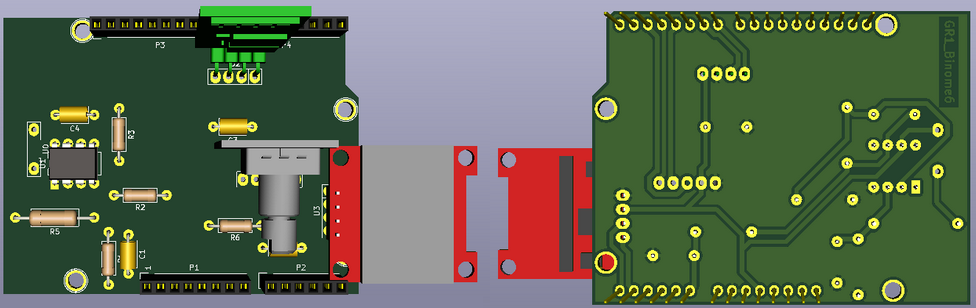

# 2020-2021 : Capteur Graphite GAICH-STEPHEN 
2020-2021 : Projet réalisé dans le cadre de l'Unité de Formation "du capteur au banc de test" en 4ème année Génie Physique, à l'INSA de Toulouse. Au cours de ce projet, nous avons réalisé un capteur de déformation/ jauge de contrainte à base de graphite 2H. Afin de mesurer la résistance de ce type de crayon, nous avons crée un dispositif bas-coût et transportable qui fut proposé par nos enseignants. Nous avons réalisé et fabriqué un PCB shield, à l'aide du logiciel Kicad, contenant un amplificateur transimpédance (circuit analogique) , un module Bluetooth, un écran OLED et un encodeur rotatoire. Ce dernier est pluggé sur un microcontrôleur Arduino Uno programmé à l'aide du logiciel Arduino IDE et contrôlé par une application android APK bluetooth. 

  - [Livrables](#livrables)
  - [PCB Shield](#pcb-shield)
  - [Code Arduino Mesure](#code-arduino-mesure)
  - [Application android APK](#application-android-apk)
  - [Protocole de test du capteur](#protocole-de-test-du-capteur)
  - [Code Arduino banc de test](#code-arduino-banc-de-test)
  - [Datasheet capteur graphite](#datasheet-capteur-graphite)
  - [Problèmes rencontrés et pistes d'améliorations](#problèmes-rencontrés-et-pistes-d-'-améliorations) 

## Livrables  

- [x] PCB shield 
- [ ] Code Arduino permettant la mesure de R et le contrôle des fonctionnalités BT, OLED... 
- [ ] Application android APK réalisé avec MIT APP INVENTOR.
- [ ] Protocole et le programme Arduino pour le banc de test
- [ ] Datasheet du capteur de déformation/ jauge de contrainte à base de graphite 2H 

## PCB Shield
Utilisation des outils présents dans le logiciel Kicad pour créer le PCB: 
[KiCad EDA - Schematic Capture & PCB Design Software](https://kicad-pcb.org/), version: 5.1.8 

Le PCB Shield est pluggé sur un microcontrôleur Arduino Uno. Un amplificateur transimpédance, un module BT, un écran OLED et un encodeur rotatoire sont présents. 

Librairies de composants:
* Capacitor THT
* Resistor THT 
* Arduino Uno

#### Composants créés : symboles & empreintes 

- *Capteur Graphique*

- *Module Bluetooth*

- *Encodeur rotatoire Keyes KY 040*

- *Ecran OLED*

- *Amplificateur LT1050* (Empreinte déjà présente : DIP-8_W7.62mm_LongPads)

#### Schématique 

Dans le Eeschema, crée à partir d'un modèle Arduino Uno, nous avons regroupé les éléments suivant trois groupes : l'amplificateur transimpédance (circuit analogique qui permet de traiter les données envoyées par le capteur (variation de résistance)), les modules permettant d'ajouter des fonctionnalités au micro-contrôleur (module Bluetooth, encodeur rotatoire, écran OLED) et les broches de la carte Arduino Uno.  

#### Placement des composants 

#### Routage 3D

 

#### Soudage du PCB

Grâce à Catherine Crouzet, travaillant au Génie Physique, INSA Toulouse, nous avons pu réaliser le PCB, modélisé sur Kicad, sur une plaquette d'epoxy possedant une fine couche cuivre (60 microns). Après avoir imprimé le typon sur du papier calque, il a été insolé aux UV pendant 2 minutes environ. Cela a permis de déposer une résine protectrice. A l'aide d'un révélateur, le masque de résine non insolée fut retiré. Ensuite, la plaquette d'epoxy a été déposée dans un bain de perchlorure de fer pour être gravée (~7-8minutes). Le cuivre a été "rongé" afin d'obtenir le PCB modélisé. Pour finir, un peu d'acétone est appliquée sur la plaquette afin de retirer la résine. 

Passons ensuite au perçage des trous de la plaquette à l'aide d'une perçeuse électrique (voir dossier image)
- 0.8mm pour ceux de l'AOP, les résistances et les capacités.
- 1mm pour ceux des connecteurs de l'Arduino et des headers des différents modules (pinces pour la feuille de graphite, bluetooth, encodeur rotatoire, écran OLED)

Pour finir, nous avons soudé chaque composant à l'aide d'un fer à souder. 

Remarque: il aurait fallu faire le diamètre des pads des connecteurs arduino plus gros afin d'avoir des soudures parfaites => peu de cuivre qui est resté autour après le perçage, ce qui a compliqué la soudure. 

## Code Arduino Mesure 
Developpé sous Arduino IDE : mesure de la résistance du graphite en fonction de la courbure de la jauge de contrainte et contrôle du module bluetooth, de l'écran OLED et de l'encodeur rotatoire. 

## Application android APK

## Protocole de test du capteur

## Code Arduino banc de test

## Datasheet capteur graphite

## Problèmes rencontrés et pistes d'améliorations
