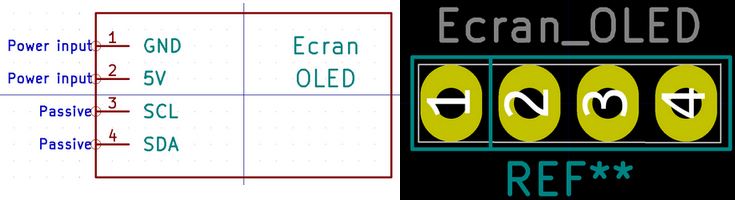
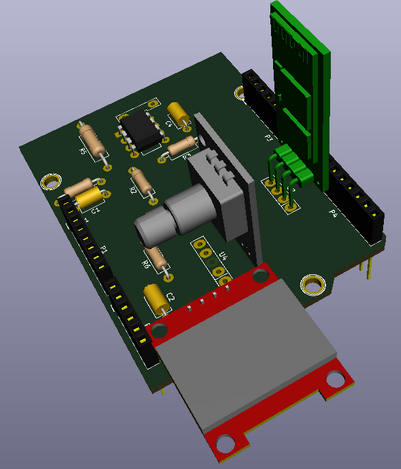
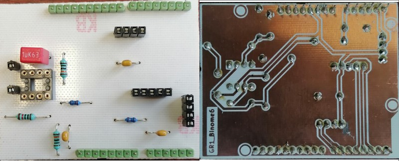

# 2020-2021 : Capteur Graphite GAICH-STEPHEN 
2020-2021 : Projet réalisé dans le cadre de l'Unité de Formation "du capteur au banc de test" en 4ème année Génie Physique, à l'INSA de Toulouse. Au cours de ce projet, nous avons réalisé un capteur de déformation/ jauge de contrainte à base de graphite 2H. Afin de mesurer la résistance de ce type de crayon, nous avons crée un dispositif bas-coût et transportable qui fut proposé par nos enseignants. Nous avons réalisé et fabriqué un PCB shield, à l'aide du logiciel Kicad, contenant un amplificateur transimpédance (circuit analogique) , un module Bluetooth, un écran OLED et un encodeur rotatoire. Ce dernier est pluggé sur un microcontrôleur Arduino Uno programmé à l'aide du logiciel Arduino IDE et contrôlé par une application android APK bluetooth. 

*** 
  - [Livrables](#livrables)
  - [PCB Shield](#pcb-shield)
  - [Code Arduino Mesure](#code-arduino-mesure)
  - [Application android APK](#application-android-apk)
  - [Banc de test](#banc-de-test)
  - [Code Arduino du banc de test](#code-arduino-du-banc-de-test)
  - [Protocole de test du capteur et les résultats obtenus](#protocole-de-test-du-capteur-et-les-résultats-obtenus)
  - [Datasheet capteur graphite](#datasheet-capteur-graphite)
  - [Problèmes rencontrés et améliorations à réaliser](#problèmes-rencontrés-et-améliorations-à-réaliser) 

*** 
## Livrables  

- [x] PCB shield 
- [x] Code Arduino permettant la mesure de R et le contrôle des fonctionnalités BT, OLED... 
- [x] Application android APK réalisé avec MIT APP INVENTOR.
- [x] Protocole et le programme Arduino pour le banc de test
- [x] Datasheet du capteur de déformation/ jauge de contrainte 

## PCB Shield
Utilisation des outils présents dans le logiciel Kicad pour créer le PCB: 
[KiCad EDA - Schematic Capture & PCB Design Software](https://kicad-pcb.org/), version: 5.1.8 

Le PCB Shield est pluggé sur un microcontrôleur Arduino Uno. Un amplificateur transimpédance, un module BT, un écran OLED et un encodeur rotatoire sont présents. 

Librairies de composants:
* Capacitor THT
* Resistor THT 
* Arduino Uno

#### Composants créés : symboles & empreintes 

- *Capteur Graphique*

- *Module Bluetooth*

- *Encodeur rotatoire Keyes KY 040*

- *Ecran OLED*

- *Amplificateur LT1050* (Empreinte déjà présente : DIP-8_W7.62mm_LongPads)

#### Schématique 

Dans le Eeschema, crée à partir d'un modèle Arduino Uno, nous avons regroupé les éléments suivant trois groupes : l'amplificateur transimpédance (circuit analogique qui permet de traiter les données envoyées par le capteur (variation de résistance)), les modules permettant d'ajouter des fonctionnalités au micro-contrôleur (module Bluetooth, encodeur rotatoire, écran OLED) et les broches de la carte Arduino Uno.  

#### Placement des composants 

#### Routage 3D

 

#### Soudage du PCB

Grâce à Catherine Crouzet, travaillant au Génie Physique, INSA Toulouse, nous avons pu réaliser notre PCB. Après avoir réalisé le schéma électrique, le placement des composants et le routage de la carte PCB sur le logiciel KiCad, le typon du PCB est imprimé sur deux feuilles calques. Les deux transparents sont alors superposés et scotchés entre eux afin de diminuer le risque de microcoupure (encre trop pale). Le typon est disposé sur la glace de l’insoleuse ainsi que la plaque d’époxy dont la face cuivrée (60µm) photosensible est du côté du typon. Cette opération dure environ deux minutes et permet d’insoler la face photosensible. Le dessin du typon est alors visible sur la face cuivrée. La plaque est ensuite plongée dans un révélateur jusqu’à ce que le dessin apparaisse parfaitement (retire la résine non insolée). Après l’avoir rincé à l’eau, la plaque est alors prête pour la gravure. Le PCB est alors place dans un bain de perchlorure de fer rongeant tout le cuivre non protégé par la résine pendant sept minutes. Après l’avoir rincé à l’eau et vérifié le circuit, la résine est retirée avec de l’acétone. Le PCB sera ensuite percé et les composants seront soudés. 

Passons ensuite au perçage des trous de la plaquette à l'aide d'une perçeuse électrique [ici](Images/Perçeuse.jpg).
- 0.8mm pour ceux de l'AOP, les résistances et les capacités.
- 1mm pour ceux des connecteurs de l'Arduino et des headers des différents modules (pinces pour la feuille de graphite, bluetooth, encodeur rotatoire, écran OLED)

Pour finir, nous avons soudé chaque composant à l'aide d'un fer à souder. 

Remarque: il aurait fallu faire le diamètre des pads des connecteurs arduino plus gros afin d'avoir des soudures parfaites => peu de cuivre qui est resté autour après le perçage, ce qui a compliqué la soudure. 

#### Détail sur le conditionneur du capteur réalisé sur le shield (électronique analogique)
Nous avons détaillé cette partie dans la datasheet à la page 5 et 6 [ici](METTRE LIEN)

## Code Arduino Mesure 
Utilisation de l'environnement Arduino IDE téléchargeable [ici](https://www.arduino.cc/en/software); version 1.8.13.

Les librairies que nous avons utilisées sont disponibles [ici](PGM_Arduino_Mesure/Librairie).

Nous avons développé un programme permettant de mesurer la résistance de notre capteur. Vous pouvez le retrouver [ici](PGM_Arduino_Mesure/Programme_Capteur_Mesure/Programme_Capteur_Mesure.ino). 
Il s'agit d'un programme basique qui lira la valeur de la tension sur le pin 1 nommé comme "capteurgraphite". Cette acquisition est cadencée à 1s. La valeur lu est ensuite mappé sur 1 byte (0 à 255) car nous avons choisi d'envoyer un chiffre d'un byte sur le bluetooth et l'APK recevrai un chiffre d'un byte à chaque tour de boucle. Cette valeur est également affiché sur le port série.

## Application android APK
Utilisation du site MIT App Inventor : [ici](https://appinventor.mit.edu/). 

Nous récupérons les données envoyées par le module bluetooth HC05 sur l'application et créons un fichier pour stocker ces dernières. 
Après de nombreux problèmes avec cet environnement et en s'inspirant du code crée par M.Grisolia, nous avons pu développer cette application. 

Face avant 

Une connexion avec le bluetooth HC05 est nécessaire. Après qu'elle soit faite, vous pourrez suivre la variation de la tension lue par l'APK "en direct". La valeur de la résistance du capteur est aussi calculée et affichée en bas de l'écran. Enfin, un fichier contenant toutes les données récupérées par le bluetooth est créé dans vos documents. 

Vous trouverez le fichier .aia [ici](APK_Bluetooth/CAPTEUR_GRAPHITE_FILE.aia) et le fichier .apk [ici](APK_Bluetooth/CAPTEUR_GRAPHITE_FILE.apk)

Nous avons essayé d'améliorer cette version en faisant plusieurs screens. 
Une page d'accueil présente ci-dessous : 

Ensuite, sur la deuxième page après avoir cliqué sur le bouton commencer l'acquisition, vous devez commencer par mesurer la résistance initiale du capteur et donner un nom au fichier de données. Tous les voyons de l'étape 1 se mettent au vert et vous pouvez voir "en direct" le tracé de la résistance relative (Rmes-Ro)/Ro au cours du temps. Les valeurs de la résistance du capteur et de la résistance relative sont aussi affichées

 

Vous trouverez le fichier .aia [ici](A METTRE) et le fichier .apk [ici](A METTRE)

## Banc de test 
Nous avons réalisé deux bancs de test "low-tech". Nous avons détaillé sa construction dans la datasheet afin que toute personne possédant notre capteur puisse retrouver les résultats que nous avons obtenus [ici](METTRE LIEN) à la page 7-8. De plus, étant réalisé à base de déchets ménagers, aucun matériel de haute pointe n'est nécessaire. 
Nous vous présentons donc nos deux bancs de test : 

Figure : Banc de test « low-tech » n°1_ récupération de déchets divers

Figure : Banc de test « low-tech » n°2 _ carton

Au début, afin de diminuer les faux contacts entre les deux pinces crocodiles, nous avions utilisé un rouleau de papier toilette que nous avions troué (voir la photo ci-dessous).
Nous n'avons pas gardé cette méthode pour les mesures en tension et compression car les cercles créés sur le banc n'était pas à la même hauteur (amélioration possible).

## Code Arduino du banc de test 
Nous avons utilisé ce programme arduino afin de déterminer les valeurs obtenues sur notre banc de test : [ici](A METTRE).(Banc de test/Banc_de_test/Banc_de_test.ino)

Pour ce faire, nous avons du améliorer une librairie nous permettant de faire le "debouncing" sur l'encodeur rotatoire [ici](PGM_Arduino_Mesure/Librairie/Encoder_Polling_V2).

Ce code intégre l'encodeur rotatoire et l'OLED. Ayant plusiers banc de tests, nous avons construit un menu pour donner l'option à l'utilisateur de choisir le type de banc de test souhaité en utilisant l'encodeur rotatoire et le boutton poussoir sur l'encodeur rotatoire. Une fois le type de banc de test choisi, le programme envoi le type de banc de test choisi à l'APK sous forme de string. Dans le fichier des données sur le portable, chaque acquisition commence donc par le type de banc de test. Une fois cette étape terminé, l'OLED affiche "le bluetooth est- il connecté" à l'utilisateur pour que l'utilisateur confirme que la connection a été établie. L'utilisateur doit appuyer sur "Oui". Ensuite, l'OLED affiche "Etes-vous prêts". L'utilisateur appuie sur "Oui" une fois prêt et l'acquisition commence. La valeur de la tension Vadc est affiché sur l'OLED et est envoyé à l'APK via le bluetooth. Quand l'utilisateur souhaite arrêter l'acquistion, il suffit d'appuyer sur le bouton 'STOP'. L'acquisition est alors arrêtée et l'OLED affiche de nouveau le menu principal.

## Protocole de test du capteur et les résultats obtenus 
Nous avons réalisé différentes expériences afin de déterminer les caractéristiques de notre capteur. 

#### Influence des dimensions du capteur 

Dans un premier temps, nous avons souhaité étudier l'influence des dimensions du capteur sur la résistance initiale. De ce fait, nous avons réalisé un plan d'expérience avec un modèle linéaire sans interactions de type TRI. Veuillez consulter ce document pour plus de détails sur la démarche : [ici](Banc_de_test&résultats/Banc_test_recherche_meilleur_capteur.docx) et sur les résultats obtenus [ici](Banc_de_test&résultats/Plan d'expérience_meilleures_dimensions.xlsx).

Nous avons pu identifier la réalité expérimentale (variables aléatoires de mesure) et tenter d’expliquer puis de maitriser au mieux les paramètres ayant un impact sur la résistance de notre capteur. Nous n’assurons pas que tous les paramètres influents furent identifiés. Elles ont aussi permis de vérifier que la résistance de notre capteur suivait la loi de Pouillet et donc la loi d’Ohm. Etant donné que nous ne sommes pas capables de déterminer le nombre de feuillets de graphite déposé lors du coloriage de notre capteur, nous allons étudier la variation relative en résistance ∆R/R_o = (R_mes-R_o)/R_o  afin d’homogénéiser nos mesures et pouvoir les comparer.  

#### Zone de non-déterioration du capteur

Dans un deuxième temps, nous nous avons essayé de determiner la zone de non-destruction du capteur. Après chaque mesure sur un rayon de courbure, nous avons noté la valeur de la tension du capteur au repos (non déformé) puis avons déterminé la résistance de ce dernier. Nous l’avons ensuite comparé à celle mesurée au début de la série de mesure. 
Document excel  [ici](Banc_de_test&résultats/Determination_zone_non_destruction_capteur.xlsx)

GRAPHES 

METTRE LEGENDE EN LES AJOUTANT

Voici notre conclusion : 

#### Influence du type de crayon utilisé pour colorier le capteur

Ensuite, nous avons étudie l'influence du type de crayon utilisé pour colorier notre capteur. Les crayons 3H, 2H, H, HB, B, 2B, et 3B furent testés successivement pour colorier notre capteur. Des tests de déformation, utilisant différents rayons de courbure de notre banc de test, sur ces capteurs furent réalisés pour enregistrer leur réponse. Ces informations sont reportées sur ces différentes graphiques. Pour de détails, consultez le document excel [ici](Banc_de_test&résultats/Mesure_RayonCoubure_Crayons_Papiers.xlsx). 

Figure n° 10 : Graphique représentant la variation relative de la résistance en fonction de la déformation en tension du capteur et du type de crayon présent sur le capteur

Figure n° 11 : Graphique représentant la variation relative de la résistance en fonction de la déformation en compression du capteur et du type de crayon présent sur le capteur

En conclusion de cette étude, le capteur colorié avec un crayon 3H est le plus sensible. En effet, pour ce capteur, la variation relative de la résistance ΔR/Ro est la plus grande. Cependant, en effectuant plusieurs expériences (colorier différents capteurs avec ce crayon), nous observons une large variabilité de la réponse. Lorsque le capteur est colorié avec des crayons 2H, H, HB, B, 2B et 3B, un comportement linéaire du ce dernier est observé. La sensibilité se définit comme le rapport entre sa valeur de sortie et sa valeur d'entrée. Lorsque le capteur est soumis à un mouvement de tension et de compression, la sensibilité du capteur augmente avec la dureté du crayon utilisé. En l’occurrence, le capteur colorié avec le crayon 3H est le plus sensible et celui colorié avec le crayon 3B est le moins sensible.

#### Influence du type de papier du capteur 

Enfin, nous avons étudié l'influence de type de papier. Nous avions émis l'hypothèse que la réponse du capteur sera différente en fonction du type de papier utilisé. Quand le capteur est réalisé sur du papier normal (70g/m²), la valeur de la résistance est trop faible pour être mesurée par notre conditionneur. La valeur de la tension Vadc est en saturation (5V). Une corrélation entre l’épaisseur du papier utilisé et la réponse du capteur existe. Nous avons détaillé une possible explication à ce phénomène dans la datasheet à la page 15. [ici](METTRE LIEN)

Pour pallier ce problème, le papier fut renforcé en enveloppant le capteur avec du ruban d’adhésif sans couvrir les pads du capteur pour la prise du contact avec les pinces crocodiles. Vous trouverez les résultats obtenus dans le fichier excel [ici](Banc_de_test&résultats/Influence_scotch.xlsx). En effectuant plusieurs tests sur le capteur, une tendance d'augmentation de la résistance st observée lorsque nous diminuons le rayon de courbure. Cependant, nous pouvons observer une augmentation initiale de la résistance entre un capteur scotché et un capteur sans ruban adhésif. Nous n’avons pas observé une amélioration de la zone de non-destruction. Dans certains cas, nous observons même une dégradation de la zone de non-destruction. Nous avons détaillé une possible explication à ce phénomène dans la datasheet à la page 15. [ici](METTRE LIEN)

## Datasheet capteur graphite
Vous pouvez retrouver la datasheet complète de notre capteur [ici](METTRE LIEN)

## Problèmes rencontrés et améliorations à réaliser

#### Problèmes sur le PCB

- Pads pour les connecteurs arduino trop fins.
- Mauvais placement de l'empreinte OLED : En testant l'écran OLED avec un programme fourni dans les libraires arduino, nous nous sommes rendus compte que, par inattention, nous avions mal placé l'empreinte (rotation 180°) car nous souhaitions que l'écran OLED soit positionné vers l'extérieur (cf PCB 3D). Afin d'avoir les bonnes pins, ce dernier doit être placé à l'intérieur. Or il y a l'encodeur rotatoire. Pour palier à ce problème, nous allons utiliser la platine d'expérimentation. 

  Améliorations : Nouveau PCB. 

  
  
#### Améliorations sur la caractérisation du capteur 

Veuillez vous référer à notre datasheet présente [ici](mettre lien) section Suggestions/Remarques. 

Nous avons détaillé différentes expérimentations que nous aurions aimées mener. Par manque de temps, nous n'avons pu les faire. 
De plus, afin de determiner concrètement les dimentions optimales du capteur, le plan d'expérience que nous avons mené devrait être complété par une étude plus approfondie (modèle de 2nd ordre) pour determiner l'optimum. Cependant, il faut pouvoir maitriser des paramètres qui ne sont pas contrôlables pour le moment (nombre de feuillets de graphite sur le capteur). 

## Note des auteurs 
Nous tenons à remercier Mme Crouzet, M.Grisolia et M.Biganzoli pour leur aide tout au long de ce projet ainsi que M.Constancias pour son aide lors de l'analyse des résultats obtenus sur notre DOE. 

Pour nous contacter : 
- Eléonore Gaich : gaich@etud.insa-toulouse.fr
- Calvin Stephen : stephen@etud.insa-toulouse.fr
